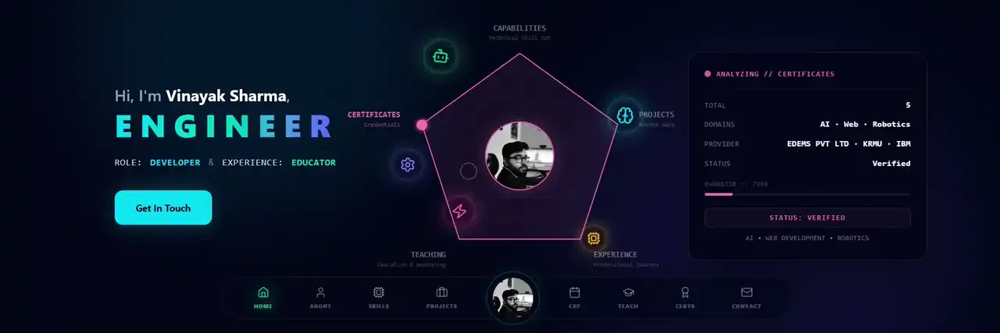
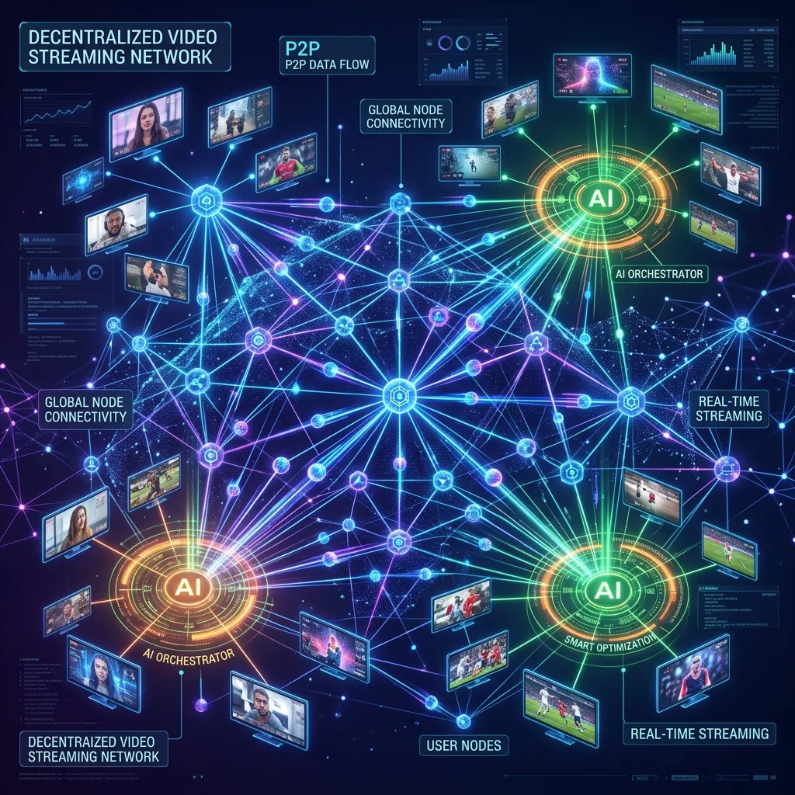
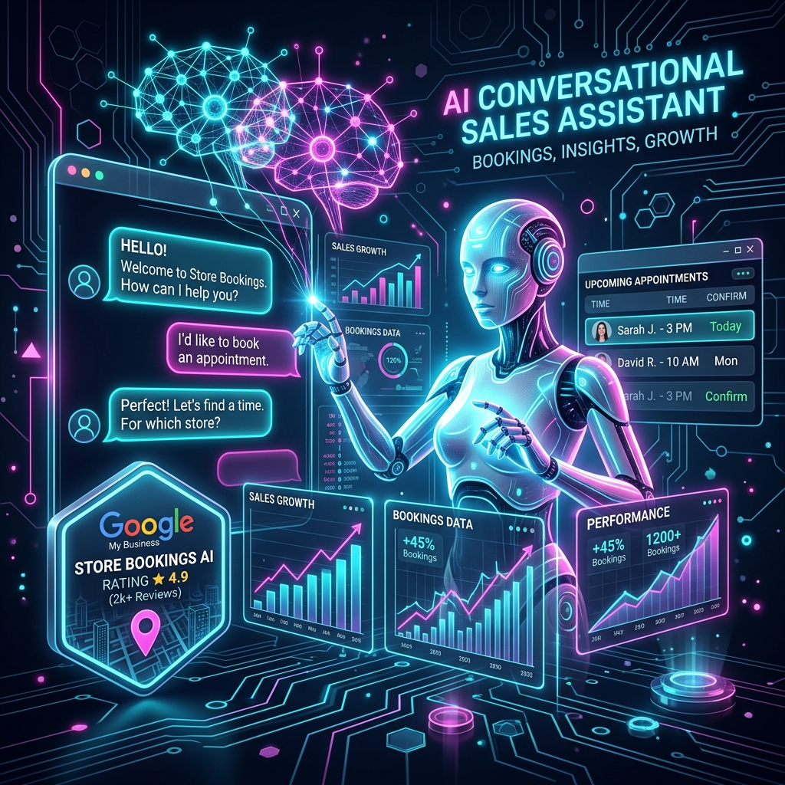
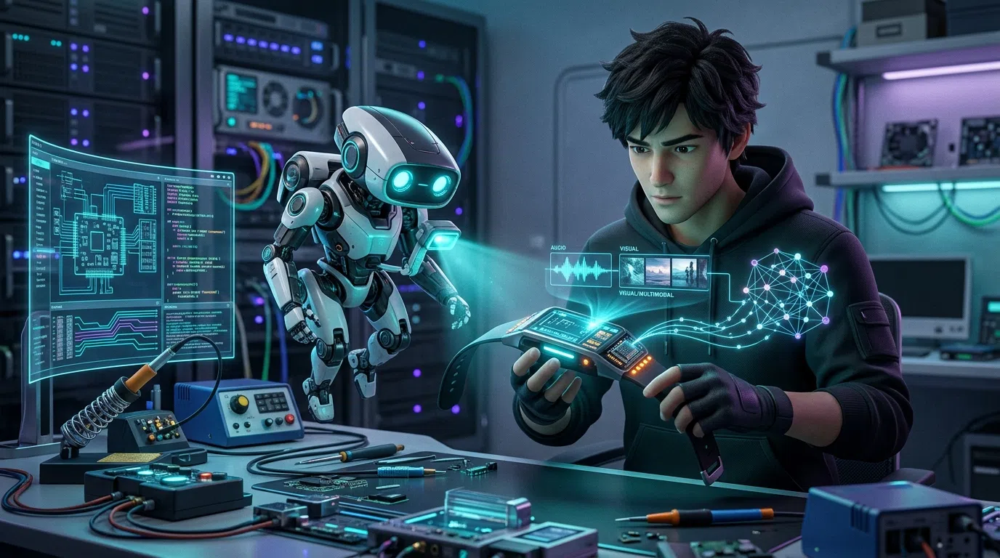
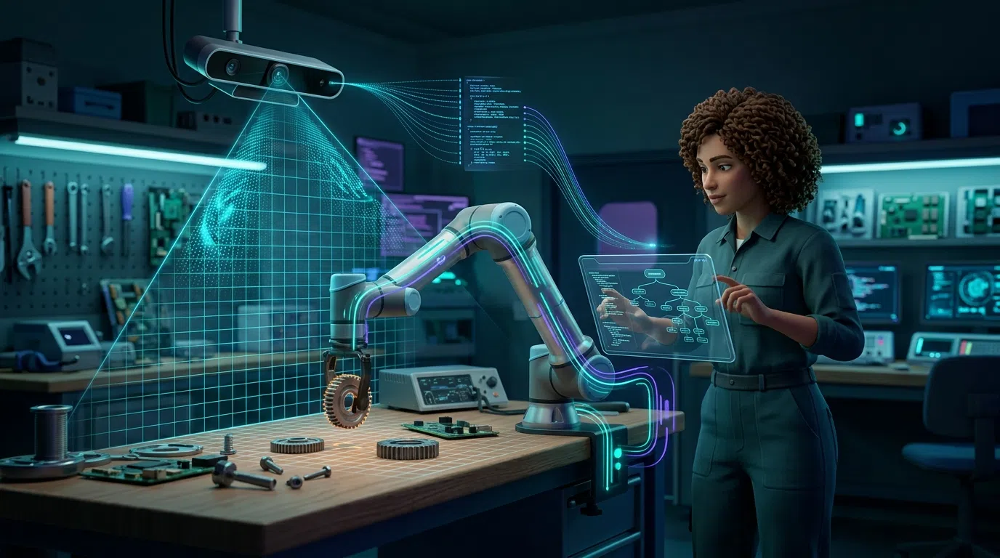

  
  
  # Vinayak Sharma
  **Web & App Developer | Agentic AI Developer | Core Contributor at EDEMS Pvt. Ltd.**

---

### 🚀 Professional Summary
- **Specialization**: Web & App Development (Flutter), Agentic AI Systems, and Coding, Robotics & STEAM Education.
- **Current Role**: Core contributor to **EDEMS Pvt. Ltd.** projects, bridging the gap between digital intelligence and physical execution.
- **Focus**: Building scalable multi-agent workflows, real-world AI applications, and fostering innovation through STEM mentorship.

---

### 🌐 Portfolio Preview

  
   
  <strong>Explore my full interactive portfolio at:</strong> <a href="https://vinayaksharmadev.vercel.app/">vinayaksharmadev.vercel.app</a>

---

### 🏢 EDEMS Pvt. Ltd. Projects & Contributions

|  |  |
| :---: | :---: |
| **[N2N Networking Platform](https://github.com/TechBastards/n2n-v)** A social and recruitment network bridging students and corporations. Features smart resume parsing and autonomous hiring agents. | **[Autonomous AI Sales Agent](https://github.com/TechBastards/gmb-sales-agent)** An enterprise-grade, mobile AI Sales CRM. Discovers business leads and manages end-to-end outreach via WhatsApp using Gemini AI. |

---

### 🌟 Personal Flagship Projects

|  |  |
| :---: | :---: |
| **[SAGE](https://github.com/TechBastards/SAGE-AI)** An intelligent wearable prototype integrating multimodal data and memory retrieval. | **[Vision-Controlled Robotic Arm](https://github.com/TechBastards/AI_Based_Vision_Controlled_Robotic_Arm_For_Selective_Object_Manipulation)** Leveraging computer vision and AI for selective object manipulation. |

---

### ⚙️ Core Engineering Competencies
- **Agentic AI & LLMs**: AI Workflow Automation, LLM Applications, Prompt Engineering, and Multi-agent orchestration.
- **Web & App Development**: Full-stack web development and cross-platform mobile apps (Flutter).
- **Robotics & Embedded**: Sensor-rich hardware prototyping, motor control logic, and electronics.
- **Computer Science Fundamentals**: DBMS, Operating Systems, Computer Networks, and Software Engineering.

---

### 🛠️ Technology Stack

  
  
  
  
  
  
  
  
  
  
  
  
  
  
  
  
  

---

### 📊 Coding Activity & LeetCode Stats

  

---

  
  
  
  
  

