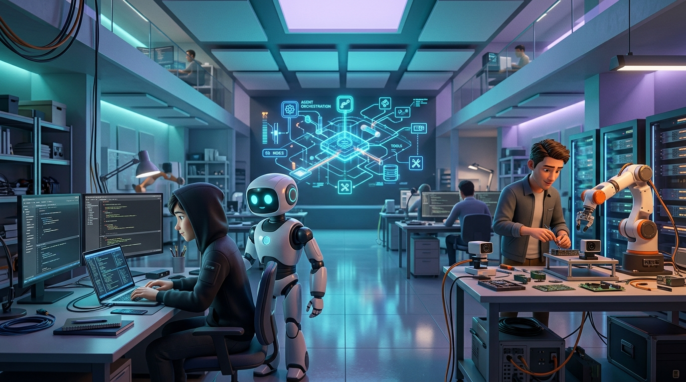

  
  
  # Vinayak Sharma
  **Agentic AI Engineer | Robotics & Embedded AI | Electronics and Robotics Trainer**
  
  *"Building Intelligent Agents. Connecting AI to the Real World."*

---

### 🚀 About Me
I build AI agents, automate workflows, integrate intelligent software with physical systems, and teach electronics and robotics through practical engineering projects. My work bridges the gap between digital intelligence and physical execution.

---

### 🌟 Featured Flagship Projects

|  |  |
| :---: | :---: |
| **[SAGE Wearable AI](https://github.com/TechBastards/SAGE-AI)** An intelligent wearable prototype integrating multimodal data and memory retrieval. | **[Vision-Controlled Robotic Arm](https://github.com/TechBastards/AI_Based_Vision_Controlled_Robotic_Arm_For_Selective_Object_Manipulation)** A robotic arm leveraging computer vision for selective object manipulation. |

---

### 🤖 Agentic AI Capabilities
- **Agent Orchestration**: Designing scalable architectures for multi-agent workflows.
- **Tool Integration**: Connecting language models with external APIs and real-world tools.
- **Memory & Retrieval**: Implementing long-term memory and RAG (Retrieval-Augmented Generation) systems.
- **Observability**: Building robust logging, monitoring, and validation into AI execution loops.

### ⚙️ Robotics & Embedded Systems
- **Computer Vision**: Integrating perception models with hardware control logic.
- **Embedded AI**: Deploying lightweight AI models on microcontrollers and edge devices.
- **Hardware Prototyping**: Developing sensor-rich embedded systems with ESP32 and similar architectures.

### 🎓 Technical Education
- **Mentorship & Training**: Simplifying complex robotics and electronics concepts through practical, reproducible projects.
- **Curriculum Design**: Creating structured learning paths for aspiring embedded engineers.

---

### 🛠️ Technology Stack

  
  
  
  
  
  
  
  
  
  
  
  
  

---

### 📊 GitHub Stats

  
   
  
   
  

---

  
  
  

 

  

